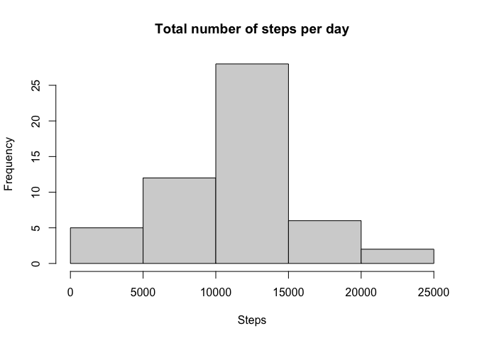
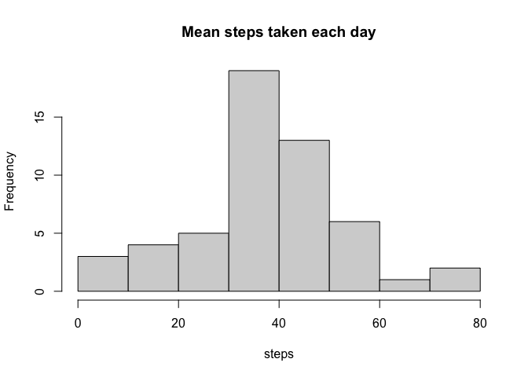
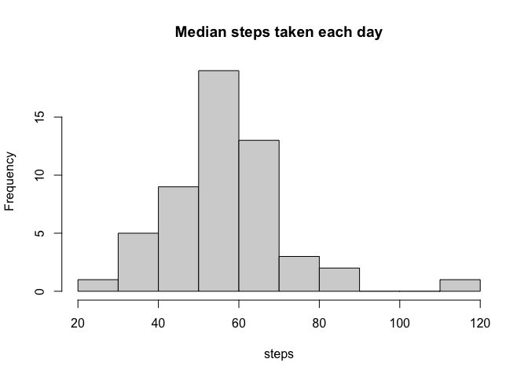
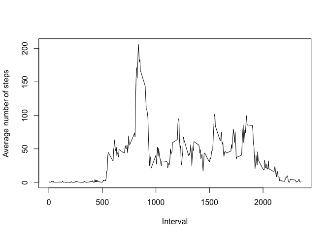
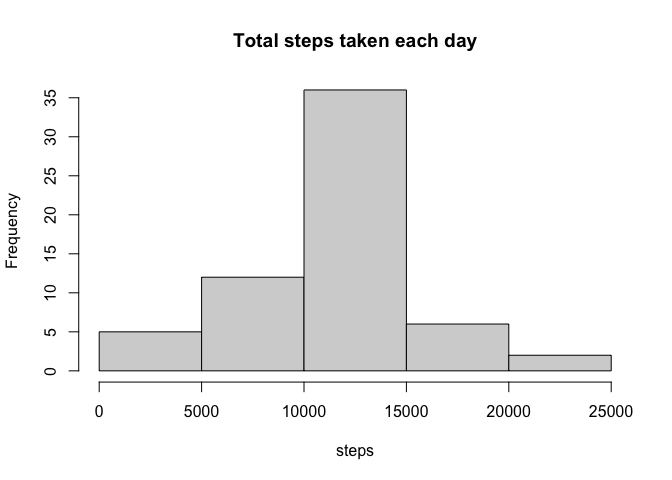
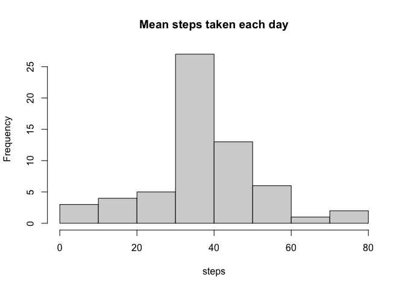
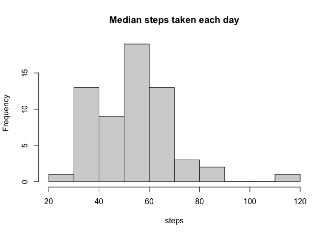
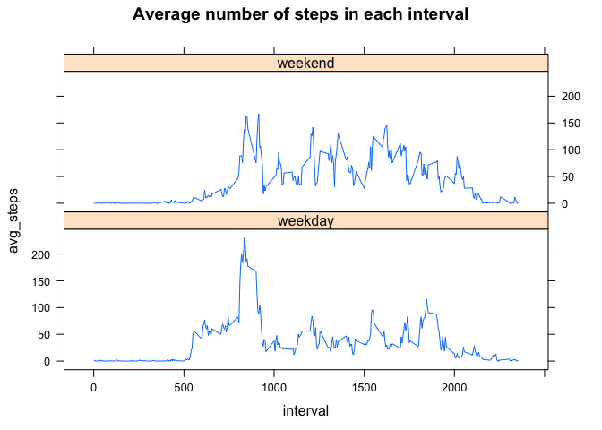

## Loading and preprocessing the data

```r
library(dplyr)
library(ggplot2)
library(gridExtra)
library(lattice)

if (!file.exists("activity.csv")){
  unzip("activity.zip")
}

raw_activity <- read.table("activity.csv", header = TRUE, sep = ",")

#remove NA values
activity <- raw_activity[complete.cases(raw_activity), ]
```

## What is the total number of steps taken per day?

```r
steps <- activity %>% group_by(date) %>% summarize(total_steps = sum(steps, na.rm = TRUE))

hist(steps$total_steps, main = "Total number of steps per day", xlab = "Steps")
```

<!-- -->

## What is mean and median total number of steps taken per day?

```r
steps <- activity %>% group_by(date) %>% 
  summarize(mean_steps = mean(steps))
hist(steps$mean_steps, main = "Mean steps taken each day", xlab = "steps")
```

<!-- -->

```r
steps <- activity %>% group_by(date) %>% 
  summarize(median_steps = median(steps[steps > 0]))

hist(steps$median_steps, main = "Median steps taken each day", xlab = "steps")
```

<!-- -->

## What is the average daily activity pattern?


```r
intervals <- activity %>% group_by(interval) %>% summarize(avg_steps = mean(steps))

plot(y = intervals$avg_steps, x = intervals$interval, 
     type = "l", xlab = "Interval", ylab = "Average number of steps")
```

<!-- -->

```r
maxSteps <- which.max(intervals$avg_steps)
```
The interval with the highest number of steps is 835


## Imputing missing values

```r
NAs <- sum(is.na(raw_activity$steps))
ratio <- NAs / nrow(raw_activity)
```
The number of NAs in the dataset is 2304 and the ratio is 0.1311475 or 13.1147541%

### Plot total, median, and mean steps after imputing missing values
I chose to impute missing values by taking the average number of steps for that interval.

```r
filled_df <- cbind(raw_activity)

#fill according to avg for that interval
for (i in c(1:nrow(filled_df))){
  if (is.na(filled_df$steps[[i]])){
    filled_df$steps[i] <- intervals[intervals$interval == filled_df$interval[[i]], ]$avg_steps
  }
}

filled_steps <- filled_df %>% group_by(date) %>% 
  summarize(total_steps = sum(steps), median_steps = median(steps[steps > 0]), mean_steps = mean(steps))

hist(filled_steps$total_steps, main = "Total steps taken each day", xlab = "steps")
```

<!-- -->

```r
hist(filled_steps$mean_steps, main = "Mean steps taken each day", xlab = "steps")
```

<!-- -->

```r
hist(filled_steps$median_steps, main = "Median steps taken each day", xlab = "steps")
```

<!-- -->
There is not much difference between the histograms with NAs removed versus histograms with NAs imputed.

## Are there differences in activity patterns between weekdays and weekends?

```r
#for each row, check whether the date occurs on a weekday or weekend
week <- function(date){
  
  weekday <- weekdays(as.Date(date), abbreviate = FALSE)
  if (weekday == "Saturday" || weekday == "Sunday"){
    return("weekend")
  }
  else {
    return("weekday")
  }
}

week_factor <- sapply(filled_df$date, week)

filled_df <- filled_df %>% mutate("weekday_factor" = week_factor)

steps_by_factor <- filled_df %>% group_by(weekday_factor, interval) %>%
  summarize(avg_steps = mean(steps))

p <- xyplot(avg_steps ~ interval | weekday_factor, 
            data=steps_by_factor, type="l",horizontal="s", 
            main="Average number of steps in each interval")
update(p, layout=c(1, 2))
```

<!-- -->

There is a spike of activity around the 800 interval during weekdays 
-- perhaps people move more getting ready and heading into work. After that spike, people move a lot less during weekdays than over the weekend; perhaps people in the dataset have desk jobs. 
